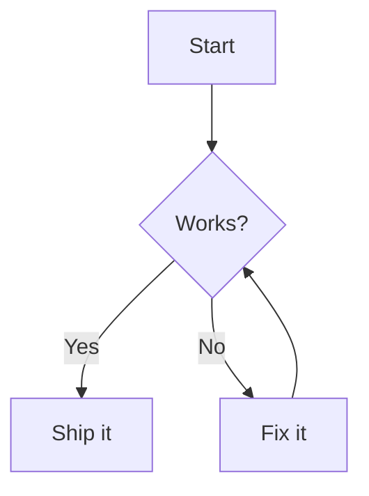
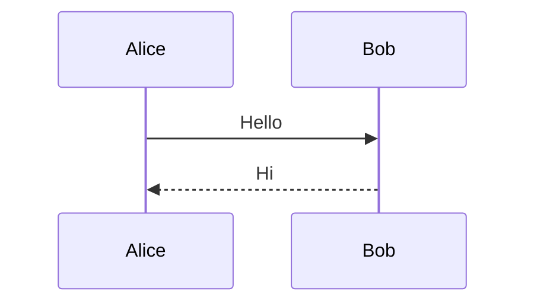

# Markdown Mermaid Rendering Implementation Plan

> **For agentic workers:** REQUIRED SUB-SKILL: Use superpowers:subagent-driven-development (recommended) or superpowers:executing-plans to implement this plan task-by-task. Steps use checkbox (`- [ ]`) syntax for tracking.

**Goal:** Render ` ```mermaid ` fenced code blocks in the `/markdown` preview as live, theme-aware SVG diagrams instead of syntax-highlighted code.

**Architecture:** A shared lazy-loaded helper (`src/lib/mermaid.ts`) owns the mermaid import, theme-aware init, render, error handling, and an SVG cache. A small custom rehype plugin lifts mermaid fences into `<div data-mermaid-src>` placeholders **before** `rehype-highlight` can corrupt the source. After the preview HTML mounts, an effect in `MarkdownPreview` renders each placeholder, with a cancellation flag (stale-render safety) and a theme dependency (re-render on light/dark toggle).

**Tech Stack:** Next.js 16, React 19, `unified`/remark/rehype pipeline, `mermaid` v11, `next-themes`, Tailwind v4.

---

## Testing note (read first)

This repo has **no automated test runner** — `package.json` scripts are only `dev`, `build`, `start`, `lint`. Introducing a test harness (vitest + jsdom + a mocked mermaid) for an async, DOM-and-visual feature would be disproportionate and against the project's established conventions (per CLAUDE.md and the writing-plans "follow established patterns" rule). Therefore each task is verified with the project's real gates — **`pnpm lint`** and **`pnpm build`** — plus a **manual browser checklist** in the final task. Do **not** start the dev server on port 3000 (it is typically already running); if a running app is needed for manual checks, use the existing dev instance or `pnpm start` on another port.

The most unit-testable unit is the pure `rehype-mermaid` transform (Task 3); if a test harness is ever added, that is the first thing to cover.

## File structure

| File | Responsibility |
| --- | --- |
| `package.json` | adds `mermaid` dependency |
| `src/lib/mermaid.ts` | **new** — singleton lazy import, theme-aware `initialize`, `renderMermaid()` helper, per-`theme:source` SVG cache |
| `src/features/markdown/components/rehype-mermaid.ts` | **new** — rehype transform: mermaid fence → `<div data-mermaid-src>` placeholder |
| `src/features/markdown/components/markdown-preview.tsx` | insert plugin into pipeline; add post-mount render effect + inline error UI + theme dependency |
| `src/app/globals.css` | screen styles for the diagram container, SVG sizing, and error box |
| `src/features/markdown/components/print-styles.tsx` | print rules so diagrams aren't clipped in PDF export |

---

## Task 1: Add the mermaid dependency

**Files:**
- Modify: `package.json` (via pnpm)

- [ ] **Step 1: Install mermaid**

Run:
```bash
pnpm add mermaid
```
Expected: `package.json` `dependencies` gains a `mermaid` entry at `^11.x`; `pnpm-lock.yaml` updates with no errors.

- [ ] **Step 2: Verify the version is v11**

Run:
```bash
node -e "console.log(require('mermaid/package.json').version)"
```
Expected: prints `11.x.y` (the helper in Task 2 relies on the v11 `mermaid.render(id, src) -> {svg}` signature and `suppressErrorRendering` config, added in 11.4+). If the printed major is not `11`, stop and reconcile before continuing.

- [ ] **Step 3: Commit**

```bash
git add package.json pnpm-lock.yaml
git commit -m "chore(markdown): add mermaid dependency"
```

---

## Task 2: Shared mermaid render helper

**Files:**
- Create: `src/lib/mermaid.ts`

- [ ] **Step 1: Create the helper**

Create `src/lib/mermaid.ts` with this exact content:

```ts
// Lazy, theme-aware wrapper around mermaid. Keeps mermaid (large) out of the
// initial bundle: it is only imported when a diagram is actually rendered.

export type MermaidTheme = "default" | "dark";
export type MermaidRenderResult = { svg: string } | { error: string };

type MermaidModule = typeof import("mermaid")["default"];

let mermaidPromise: Promise<MermaidModule> | null = null;
let lastTheme: MermaidTheme | null = null;
let idCounter = 0;

// Cache rendered SVGs so unchanged diagrams don't re-render on every
// debounced keystroke. Keyed by theme + source.
const svgCache = new Map<string, string>();

function loadMermaid(): Promise<MermaidModule> {
  if (!mermaidPromise) {
    mermaidPromise = import("mermaid").then((mod) => mod.default);
  }
  return mermaidPromise;
}

export async function renderMermaid(
  source: string,
  theme: MermaidTheme,
): Promise<MermaidRenderResult> {
  const cacheKey = `${theme}:${source}`;
  const cached = svgCache.get(cacheKey);
  if (cached) return { svg: cached };

  try {
    const mermaid = await loadMermaid();

    // mermaid bakes the theme at initialize() time, so re-init on theme change.
    if (lastTheme !== theme) {
      mermaid.initialize({
        startOnLoad: false,
        securityLevel: "strict",
        suppressErrorRendering: true,
        theme,
      });
      lastTheme = theme;
    }

    const id = `mermaid-render-${idCounter++}`;
    const { svg } = await mermaid.render(id, source);
    svgCache.set(cacheKey, svg);
    return { svg };
  } catch (err) {
    const message =
      err instanceof Error ? err.message : "Failed to render diagram";
    return { error: message };
  }
}
```

- [ ] **Step 2: Lint the new file**

Run:
```bash
pnpm lint
```
Expected: PASS with no errors (warnings, if any, are acceptable). If `suppressErrorRendering` or `securityLevel: "strict"` produces a *type* error, the installed mermaid is older than expected — re-check Task 1 Step 2 rather than removing the option.

- [ ] **Step 3: Commit**

```bash
git add src/lib/mermaid.ts
git commit -m "feat(markdown): add lazy theme-aware mermaid render helper"
```

---

## Task 3: rehype plugin to protect mermaid source

**Files:**
- Create: `src/features/markdown/components/rehype-mermaid.ts`

Why: `rehype-highlight` runs over every code block and would wrap mermaid source in highlight `<span>`s, corrupting it. This plugin runs **before** highlight and converts each `<pre><code class="language-mermaid">` into a plain `<div data-mermaid-src="…">` placeholder, so highlight never sees it and the source survives verbatim.

- [ ] **Step 1: Create the plugin**

Create `src/features/markdown/components/rehype-mermaid.ts` with this exact content:

```ts
// Custom rehype plugin. Must run BEFORE rehype-highlight so the mermaid source
// is lifted out of the code block before highlight tokenizes (and corrupts) it.
// Each `<pre><code class="language-mermaid">` becomes a `<div data-mermaid-src>`
// placeholder that MarkdownPreview renders into after mount.

// Minimal local HAST shape (avoids depending on @types/hast).
interface HastNode {
  type: string;
  tagName?: string;
  value?: string;
  properties?: Record<string, unknown>;
  children?: HastNode[];
}

function transform(node: HastNode): void {
  const children = node.children;
  if (!children) return;

  for (const child of children) {
    if (child.type === "element" && child.tagName === "pre" && child.children) {
      const code = child.children.find(
        (c) => c.type === "element" && c.tagName === "code",
      );
      const className = code?.properties?.className;
      const isMermaid =
        Array.isArray(className) && className.includes("language-mermaid");

      if (code && isMermaid) {
        const source = (code.children ?? [])
          .map((c) => (c.type === "text" ? (c.value ?? "") : ""))
          .join("");

        // Mutate the <pre> in place into the placeholder <div>.
        // `dataMermaidSrc` serializes to the `data-mermaid-src` attribute.
        child.tagName = "div";
        child.properties = { dataMermaidSrc: source };
        child.children = [];
        continue;
      }
    }
    transform(child);
  }
}

export function rehypeMermaid() {
  return (tree: unknown) => {
    transform(tree as HastNode);
  };
}
```

- [ ] **Step 2: Lint the new file**

Run:
```bash
pnpm lint
```
Expected: PASS (no errors).

- [ ] **Step 3: Commit**

```bash
git add src/features/markdown/components/rehype-mermaid.ts
git commit -m "feat(markdown): add rehype plugin to lift mermaid fences"
```

---

## Task 4: Wire rendering into MarkdownPreview

**Files:**
- Modify: `src/features/markdown/components/markdown-preview.tsx` (full rewrite — file is small)

- [ ] **Step 1: Replace the file content**

Replace the entire contents of `src/features/markdown/components/markdown-preview.tsx` with:

```tsx
"use client";

import { useMemo, useState, useEffect, useRef } from "react";
import { useTheme } from "next-themes";
import { unified } from "unified";
import remarkParse from "remark-parse";
import remarkGfm from "remark-gfm";
import remarkMath from "remark-math";
import remarkRehype from "remark-rehype";
import rehypeStringify from "rehype-stringify";
import rehypeHighlight from "rehype-highlight";
import rehypeKatex from "rehype-katex";
import "katex/dist/katex.min.css";
import { rehypeMermaid } from "./rehype-mermaid";
import { renderMermaid, type MermaidTheme } from "@/lib/mermaid";

const processor = unified()
  .use(remarkParse)
  .use(remarkGfm)
  .use(remarkMath)
  .use(remarkRehype)
  .use(rehypeMermaid)
  .use(rehypeKatex)
  .use(rehypeHighlight, { detect: true })
  .use(rehypeStringify);

interface MarkdownPreviewProps {
  content: string;
}

function useDebouncedValue(value: string, delay: number) {
  const [debounced, setDebounced] = useState(value);
  const timeoutRef = useRef<ReturnType<typeof setTimeout>>(undefined);

  useEffect(() => {
    timeoutRef.current = setTimeout(() => setDebounced(value), delay);
    return () => clearTimeout(timeoutRef.current);
  }, [value, delay]);

  return debounced;
}

export function MarkdownPreview({ content }: MarkdownPreviewProps) {
  const debouncedContent = useDebouncedValue(content, 150);
  const { resolvedTheme } = useTheme();
  const articleRef = useRef<HTMLElement | null>(null);

  const html = useMemo(() => {
    if (!debouncedContent.trim()) return "";
    try {
      return String(processor.processSync(debouncedContent));
    } catch {
      return "<p>Error rendering markdown</p>";
    }
  }, [debouncedContent]);

  // After the HTML mounts, render any mermaid placeholders into SVGs.
  useEffect(() => {
    const article = articleRef.current;
    if (!article) return;
    const blocks = article.querySelectorAll<HTMLElement>("[data-mermaid-src]");
    if (blocks.length === 0) return;

    let cancelled = false;
    const theme: MermaidTheme = resolvedTheme === "dark" ? "dark" : "default";

    (async () => {
      for (const block of Array.from(blocks)) {
        const source = block.getAttribute("data-mermaid-src");
        if (!source) continue;

        // Skip if this node already holds the right diagram for this theme.
        const stamp = `${theme}:${source}`;
        if (block.dataset.mermaidStamp === stamp) continue;

        const result = await renderMermaid(source, theme);
        if (cancelled) return;

        if ("svg" in result) {
          block.innerHTML = result.svg;
          block.classList.remove("md-mermaid-error");
        } else {
          // Build the error box with the DOM API so the source can't inject HTML.
          const box = document.createElement("div");
          const msg = document.createElement("p");
          msg.textContent = result.error;
          const pre = document.createElement("pre");
          const code = document.createElement("code");
          code.textContent = source;
          pre.appendChild(code);
          box.appendChild(msg);
          box.appendChild(pre);
          block.replaceChildren(box);
          block.classList.add("md-mermaid-error");
        }
        block.dataset.mermaidStamp = stamp;
      }
    })();

    return () => {
      cancelled = true;
    };
  }, [html, resolvedTheme]);

  if (!html) {
    return (
      <div className="flex items-center justify-center h-full text-sm text-muted-foreground/40 select-none print:hidden">
        Preview will appear here
      </div>
    );
  }

  return (
    <article
      ref={articleRef}
      className="md-preview prose prose-neutral dark:prose-invert max-w-none p-6"
      dangerouslySetInnerHTML={{ __html: html }}
    />
  );
}
```

- [ ] **Step 2: Lint**

Run:
```bash
pnpm lint
```
Expected: PASS (no errors).

- [ ] **Step 3: Commit**

```bash
git add src/features/markdown/components/markdown-preview.tsx
git commit -m "feat(markdown): render mermaid diagrams in preview"
```

---

## Task 5: Styles (screen + print)

**Files:**
- Modify: `src/app/globals.css` (append a block at end of file)
- Modify: `src/features/markdown/components/print-styles.tsx` (add a rule inside the existing `@media print` CSS)

- [ ] **Step 1: Add screen styles**

Append to the end of `src/app/globals.css`:

```css
/* Mermaid diagrams in the Markdown preview */
.md-preview [data-mermaid-src] {
  display: flex;
  justify-content: center;
  margin: 1.5rem 0;
}

.md-preview [data-mermaid-src] svg {
  max-width: 100%;
  height: auto;
}

.md-preview .md-mermaid-error {
  display: block;
  width: 100%;
  border: 1px solid var(--destructive);
  border-radius: var(--radius);
  padding: 0.75rem 1rem;
  background: color-mix(in oklab, var(--destructive) 8%, transparent);
}

.md-preview .md-mermaid-error p {
  margin: 0 0 0.5rem;
  font-size: 0.8125rem;
  font-weight: 500;
  color: var(--destructive);
}
```

- [ ] **Step 2: Add print styles**

In `src/features/markdown/components/print-styles.tsx`, inside the `const css = \`...\`` template (which is wrapped in `@media print { ... }`), add this rule just before the closing `}` of the `@media print` block (e.g. right after the `.md-preview .katex-display > .katex { ... }` rule):

```css
  .md-preview [data-mermaid-src] {
    display: flex !important;
    justify-content: center !important;
    margin: 12pt 0 !important;
    break-inside: avoid !important;
    page-break-inside: avoid !important;
  }

  .md-preview [data-mermaid-src] svg {
    max-width: 100% !important;
    height: auto !important;
  }
```

Note: diagrams print using whatever theme is active on screen. Dark-theme diagrams on a white page will look off — for clean PDFs, switch to light theme before exporting. (Documented limitation; not handled here.)

- [ ] **Step 3: Lint + build**

Run:
```bash
pnpm lint && pnpm build
```
Expected: lint PASS; `pnpm build` completes successfully (this is the real check that the dynamic `import("mermaid")` and the rehype pipeline compile and bundle under Turbopack). If the build fails on the mermaid import, capture the error — do not silently remove the dynamic import.

- [ ] **Step 4: Commit**

```bash
git add src/app/globals.css src/features/markdown/components/print-styles.tsx
git commit -m "feat(markdown): style mermaid diagrams for screen and print"
```

---

## Task 6: Manual verification

**Files:** none (verification only)

- [ ] **Step 1: Open the markdown tool**

Use the already-running dev instance (or `pnpm start` on a non-3000 port after `pnpm build`). Navigate to `/markdown`.

- [ ] **Step 2: Render a valid diagram**

Paste this into the editor:

````markdown
# Mermaid test



Some text after.



```js
const x = 1; // a normal code block, should stay highlighted
```
````

Expected: both mermaid blocks render as SVG diagrams (centered); the `js` block is still syntax-highlighted; the trailing text renders normally.

- [ ] **Step 3: Check all three view modes**

Toggle Editor / Split / Preview. Expected: diagrams appear in Split and Preview; no console errors.

- [ ] **Step 4: Theme toggle**

Switch the app between light and dark. Expected: diagrams re-render in the matching mermaid theme (light vs dark) without a page reload.

- [ ] **Step 5: Error handling**

Add a broken diagram:

````markdown
```mermaid
graph TD
  A --> 
```
````

Expected: an inline error box (message + the raw source) appears in place of that diagram; the rest of the document still renders.

- [ ] **Step 6: Rapid edit (race) check**

Quickly edit a diagram's source several times. Expected: the final rendered diagram matches the final source (no stale diagram left behind).

- [ ] **Step 7: PDF export**

With at least one valid diagram, press `⌘⇧E` (or `Ctrl+Shift+E`) to export. Expected: the print preview / PDF includes the rendered diagram, not clipped at the page edge.

- [ ] **Step 8: No-mermaid bundle check**

Confirm a document with no mermaid blocks behaves exactly as before (and ideally that the mermaid chunk only loads when a diagram is present — observable in the Network tab as a lazily-loaded chunk).

- [ ] **Step 9: Final summary**

Report results of each check. If all pass, the feature is complete.

---

## Self-review (completed by plan author)

- **Spec coverage:** lazy helper (Task 2) ✓ · rehype plugin between remarkRehype and rehypeHighlight (Task 3 + Task 4 pipeline order) ✓ · post-mount render effect with cancellation + theme re-render + cache + unique ids + inline error (Task 2 cache/ids, Task 4 effect) ✓ · `securityLevel: strict` + `suppressErrorRendering` (Task 2) ✓ · print `max-width: 100%` (Task 5) ✓ · no-mermaid-no-bundle (Task 2 lazy import, Task 6 Step 8) ✓.
- **Placeholder scan:** no TBD/TODO; all code blocks complete.
- **Type/name consistency:** `renderMermaid(source, theme)` and `MermaidTheme` exported in Task 2 and imported identically in Task 4; `data-mermaid-src` produced in Task 3 and queried in Tasks 4/5; `md-mermaid-error` class set in Task 4 and styled in Task 5. Consistent.
